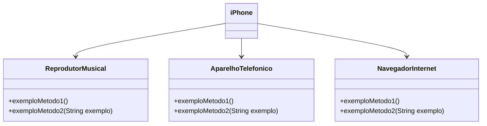

# dio-trilha-java-básico

# DIO - Trilha Java Básico
www.dio.me

#### Autores
- [Gleyson Sampaio](https://github.com/glysns)

## Sintaxe - Desafio

Vamos exercitar todo o conteúdo apresentado no módulo de Sintaxe codificando o seguinte cenário.

1. Crie o projeto `ContaBanco` que receberá dados via terminal contendo as características de conta em banco conforme atributos abaixo:
2. Dentro do projeto, crie a classe `ContaTerminal.java` para realizar toda a codificação do nosso programa.

###### Revise sobre regras de declaração de variáveis

| Atributo  | Tipo     | Exemplo   
| --------- | ---------| ------- 
| Numero    | Inteiro  | 1021 
| Agencia   | Texto    | 067-8
| Nome Cliente | Texto    | MARIO ANDRADE
| Saldo | Decimal |237.48


###### Revise sobre terminal, main args e a classe Scanner
2. Permita que os dados sejam inseridos via terminal sendo que o usuário receberá a mensagem de qual informação será solicitada, exemplo:

* Programa: "Por favor, digite o número da Agência !"
* Usuário: 1021 *(depois ENTER para o próximo campo)* 

###### Revise sobre concatenação e classe String com método concat

3. Depois de todas as informações terem sido inseridas, o sistema deverá exibir a seguinte mensagem:

*"Olá [Nome Cliente], obrigado por criar uma conta em nosso banco, sua agência é [Agencia], conta [Numero] e seu saldo [Saldo] já está disponível para saque".*

Os campos em [ ] devem ser alterados pelas informações que forem inseridas pelos usuários.


# DIO - Trilha Java Básico
www.dio.me

#### Autores
- [Gleyson Sampaio](https://github.com/glysns)

## Controle de Fluxo - Desafio

Vamos exercitar todo o conteúdo apresentado no módulo de Controle de Fluxo codificando o seguinte cenário.

O sistema deverá receber dois parâmetros via terminal que representarão dois números inteiros, com estes dois números você deverá obter a quantidade de interações (for) e realizar a impressão no console (System.out.print) dos números incrementados, exemplo:

* Se você passar os números 12 e 30, logo teremos uma interação (for) com 18 ocorrências para imprimir os números, exemplo: `"Imprimindo o número 1"`, `"Imprimindo o número 2"` e assim por diante.
* Se o primeiro parâmetro for MAIOR que o segundo parâmetro, você deverá lançar a exceção customizada chamada de `ParametrosInvalidosException` com a segunda mensagem: "O segundo parâmetro deve ser maior que o primeiro"   


1. Crie o projeto `DesafioControleFluxo`
2. Dentro do projeto, crie a classe `Contador.java` para realizar toda a codificação do nosso programa.
3. Dentro do projeto, crie a classe `ParametrosInvalidosException` que representará a exceção de negócio no sistema. 

Abaixo temos um trecho de código no qual você poderá seguir alterando as partes que contenham `??`

```java
public class Contador {
	public static void main(String[] args) {
		Scanner terminal = new Scanner(System.in);
		System.out.println("Digite o primeiro parâmetro");
		int parametroUm = terminal.??;
		System.out.println("Digite o segundo parâmetro");
		int parametroDois = terminal.??;
		
		try {
			//chamando o método contendo a lógica de contagem
			contar(parametroUm, parametroDois);
		
		}catch (? exception) {
			//imprimir a mensagem: O segundo parâmetro deve ser maior que o primeiro
		}
		
	}
	static void contar(int parametroUm, int parametroDois ) throws ParametrosInvalidosException {
		//validar se parametroUm é MAIOR que parametroDois e lançar a exceção
		
		int contagem = parametroDois - parametroUm;
		//realizar o for para imprimir os números com base na variável contagem
	}
}
```


# [DIO](www.dio.me) - Trilha Java Básico

## Autores
- [Gleyson Sampaio](https://github.com/glysns)

## POO - Desafio

### Modelagem e Diagramação de um Componente iPhone

Neste desafio, você será responsável por modelar e diagramar a representação UML do componente iPhone, abrangendo suas funcionalidades como Reprodutor Musical, Aparelho Telefônico e Navegador na Internet.

#### Contexto
Com base no vídeo de lançamento do iPhone de 2007 (link abaixo), você deve elaborar a diagramação das classes e interfaces utilizando uma ferramenta UML de sua preferência. Em seguida, implemente as classes e interfaces no formato de arquivos `.java`.

[Lançamento iPhone 2007](https://www.youtube.com/watch?v=9ou608QQRq8)
- Minutos relevantes: 00:15 até 00:55

#### Funcionalidades a Modelar
1. **Reprodutor Musical**
   - Métodos: `tocar()`, `pausar()`, `selecionarMusica(String musica)`
2. **Aparelho Telefônico**
   - Métodos: `ligar(String numero)`, `atender()`, `iniciarCorreioVoz()`
3. **Navegador na Internet**
   - Métodos: `exibirPagina(String url)`, `adicionarNovaAba()`, `atualizarPagina()`

### Objetivo
1. Criar um diagrama UML que represente as funcionalidades descritas acima.
2. Implementar as classes e interfaces correspondentes em Java (Opcional).

### Exemplo de Diagrama UML (Mermaid)


### Instruções
1. Assista ao vídeo do lançamento do iPhone para entender as funcionalidades principais.
2. Utilize uma ferramenta UML de sua preferência para criar o diagrama das classes e interfaces. Você pode utilizar o modelo acima (criado na sintaxe [Mermaid](https://mermaid.js.org/)), uma alternativa open-source e compatível com arquivos Markdown como este.
3. Opcionalmente, caso esteja cheio(a) de confiança, pode implementar as classes Java representadas em seu diagrama UML.
4. Submeta seu repositório GitHub conforme as orientações da plataforma DIO. Por exemplo:

```bash
https://github.com/glysns/trilha-java-basico/desafios/poo/README.md
```` 
